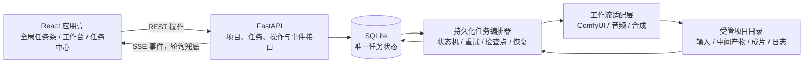

# AI 短剧工坊 V5 一键化升级设计

- 日期：2026-07-17
- 工作区：`D:\AI_Manga_Studio`
- 状态：架构与交互方案已确认，本文档待最终复核
- 目标版本：V5 可靠生产版

## 1. 摘要

本次升级把当前由多套脚本、临时线程和页面局部状态拼接而成的 V5 项目，收敛为一个可持续运行、可恢复、可人工干预的 AI 短剧制作系统。

用户从小说、剧本或分镜表任一输入开始，设置单镜头 5–15 秒、预设或自定义分辨率，并一键执行完整制作链。系统默认全自动运行；只有用户主动开启“人工审核模式”时，才在阶段边界暂停等待审核。

任务状态和阶段检查点持久化到 SQLite。切换页面、刷新浏览器、重启后端或重启电脑后，页面都从服务端恢复同一任务状态。生成失败时最多自动重试 3 次，随后明确失败并停在故障步骤；已完成产物保持有效，修复后从最近有效检查点继续，禁止生成占位图、替代视频或伪成功成片。

## 2. 当前项目审计结论

### 2.1 已有基础

当前项目已经具备以下可复用能力：

- FastAPI 后端、React/Vite/Ant Design 前端和本地 SQLite；
- 小说解析、镜头表、首尾帧、ComfyUI 调用、视频生成和合成等模块；
- V5 导演提示、角色表、连续性控制等设计；
- X 盘中的 V4、V11、历史任务、资源、工作流和真实生成资产可作为只读参考。

### 2.2 必须解决的问题

1. **任务状态只存在于页面局部内存。** `Pipeline.tsx` 卸载后进度消失，页面切换无法恢复。
2. **后端任务只存在于进程内存。** `_jobs` 在后端或电脑重启后丢失，没有任务历史和恢复接口。
3. **多个版本同时存在。** V5、V7、V11 和不同入口对“完成”的定义不一致，容易运行错流程。
4. **解析阶段破坏断点。** 重新解析会把镜头状态重写为等待，已完成状态无法可靠复用。
5. **降级产物被当成成功。** ComfyUI 失败时会生成本地标题卡或插值视频并标记成功，违反真实生产要求。
6. **最终合成可能伪成功。** 合成调用参数与实际签名不一致，失败后可能用第一段视频充当最终成片。
7. **请求选项未贯穿执行。** 章节、配音、字幕、背景音乐等字段虽存在，但执行链没有完整使用。
8. **取消不是真取消。** 页面状态改变后后台线程仍可能继续运行。
9. **启动检查不可靠。** Windows 下对 `npm` 的检测方式错误，无法准确报告环境状态。
10. **工程检查缺口。** 测试会误收集 ComfyUI 和输出目录，前端缺少有效的 lint 配置。

## 3. 设计目标与非目标

### 3.1 本次必须实现

- 小说、剧本、分镜表三种输入自动识别并统一为制作计划；
- 单镜头时长限制为 5–15 秒，支持逐镜头调整；
- 支持常用分辨率预设和用户自定义宽高；
- 一个可靠的生产入口和一个明确的 V5 生产链；
- 默认全自动，仅人工审核模式在阶段边界暂停；
- 所有阶段支持预览、编辑、批准、重试和回退；
- 任务、步骤、产物、日志、审核与迁移记录持久化；
- 页面切换、浏览器刷新、后端重启、电脑重启后的恢复；
- 最多自动重试 3 次，失败后停在原步骤；
- 禁止运行时生成占位内容或把降级结果标记为成功；
- 真正的暂停、继续、回退、取消；
- 配音、口型、音效、字幕、背景音乐、质检、合成和导出；
- 现有项目及 X 盘参考项目的安全盘点与可选迁移；
- 一键启动检查、自动化测试和浏览器回归验收。

### 3.2 后续扩展

以下能力不阻塞本次可靠生产版：

- 多机分布式 GPU 调度；
- 云端账号、商业计费和团队权限；
- 在线素材市场和模型自动下载；
- 移动端完整编辑器；
- 无人值守批量发布到第三方平台。

## 4. 核心设计原则

1. **SQLite 是任务状态的唯一可信来源。** 网页只读取和操作服务端状态，不自行推断任务进度。
2. **先保存产物和检查点，再推进状态。** 只有产物验证通过并完成原子写入后，步骤才可标记成功。
3. **默认继续，不默认重跑。** 有效检查点直接复用；只有输入变化、主动回退或产物失效时才重跑下游。
4. **真实失败优于伪成功。** 任何模型、节点、工作流或输出异常都以故障呈现，不生成占位降级结果。
5. **版本收敛。** 新 Web/API 只调用统一生产编排器；旧入口暂时保留为只读兼容或迁移来源，不能继续承担正式生产。
6. **破坏性操作显式确认。** 回退或删除前展示将失效的步骤和产物；原始输入与迁移来源默认保留。

## 5. 总体架构

### 5.1 应用壳与全局任务状态

`JobProvider` 放在路由之外的应用根节点。它通过任务查询接口获取当前任务，并订阅服务端事件；EventSource 不可用时，以短轮询兜底。

顶部全局任务条在所有主功能页持续存在，展示项目名、当前阶段、镜头进度、总进度、运行状态及暂停/继续/任务中心入口。路由切换只改变内容区，不销毁任务上下文。

前端 API 地址由当前页面地址和环境配置解析，不硬编码 `localhost`，避免 `localhost`、`127.0.0.1` 和 IPv6 解析差异导致空数据。

### 5.2 持久化编排器

FastAPI 生命周期启动一个本地持久化 Worker。Worker 只从数据库领取任务，并用租约和心跳标记拥有关系。步骤执行前读取输入版本与上游检查点，执行后验证产物、原子提交检查点并发布事件。

后端重启时：

- 租约过期且原状态为 `running` 的任务进入恢复队列；
- 已成功检查点保持不变；
- `failed` 任务保持失败，等待用户修复并点击继续；
- `waiting_review` 和 `paused` 保持暂停；
- `cancelled` 和 `completed` 不重新运行。

### 5.3 工作流适配层

生产编排器不直接拼接不同版本脚本，而通过统一适配接口调用：

- 图像与视频：ComfyUI 工作流适配器；
- 配音与口型：语音及口型适配器；
- 音效、字幕和背景音乐：音频时间线适配器；
- 质检：图像、视频、音频和连续性验证器；
- 合成：CinemaComposer 适配器。

每个适配器都返回结构化结果：真实产物路径、媒体信息、日志摘要、工作流版本、可重试性和故障原因。旧的标题卡、插值视频等运行时降级逻辑不再被生产入口调用。

## 6. 数据模型

### 6.1 主要表

| 表 | 用途 | 关键字段 |
|---|---|---|
| `projects` | 项目及输入配置 | `id`、`name`、`input_type`、`input_path`、`settings_json`、`created_at` |
| `jobs` | 一次完整制作任务 | `id`、`project_id`、`status`、`mode`、`current_stage`、`current_shot`、`progress`、`desired_state`、`lease_until` |
| `job_steps` | 阶段或镜头级步骤 | `id`、`job_id`、`stage_key`、`shot_id`、`status`、`attempt`、`input_hash`、`error_code`、`error_message` |
| `artifacts` | 所有真实产物索引 | `id`、`step_id`、`kind`、`path`、`sha256`、`size`、`metadata_json`、`validated_at` |
| `job_events` | UI 时间线与审计 | `id`、`job_id`、`event_type`、`payload_json`、`created_at` |
| `review_actions` | 人工审核记录 | `id`、`step_id`、`action`、`comment`、`input_version`、`created_at` |
| `migration_records` | 旧项目迁移映射 | `id`、`source_path`、`source_hash`、`target_project_id`、`result`、`details_json` |

### 6.2 版本与失效规则

每个步骤计算 `input_hash`，内容包括：

- 上游产物校验值；
- 用户配置快照；
- 提示词或脚本版本；
- 使用的模型和工作流版本；
- 目标镜头时长与分辨率。

继续前同时检查 `input_hash` 和产物是否存在、可读取且校验值一致。二者均有效时直接跳过。用户编辑上游或确认回退后，系统从变更点开始将下游检查点标记为失效，但不立即删除原文件；清理行为独立执行并保留审计记录。

## 7. 任务状态机

### 7.1 状态集合

- `draft`：项目已创建，尚未排队；
- `queued`：等待 Worker 领取；
- `running`：正在执行；
- `waiting_review`：人工审核模式下等待用户操作；
- `retry_wait`：自动重试退避中；
- `failed`：重试耗尽或明确故障，停在原步骤；
- `paused`：用户主动暂停；
- `completed`：真实最终成片验证通过；
- `cancelled`：用户取消且执行已停止。

### 7.2 重试规则

每个执行步骤首次失败后最多再自动重试 3 次，建议退避为 5 秒、15 秒、45 秒。每次失败都记录工作流、日志、故障码和尝试次数。

第 3 次重试仍失败时：

- 当前步骤转为 `failed`；
- 任务停在该阶段和镜头；
- 已完成检查点和产物不变；
- 后续步骤不执行；
- UI 明确显示故障、尝试次数和处理入口。

修复后点击“从本步骤继续”，系统重新校验上游，只执行故障步骤。若用户更换工作流或修改参数，相应步骤得到新的 `input_hash`，成功后自动继续。

### 7.3 暂停、继续、回退和取消

- **暂停：** 设置 `desired_state=paused`。执行器在安全边界停止领取新步骤；适配器支持时可中止当前远端任务。
- **继续：** 将可恢复任务重新排队，从最近有效检查点开始。
- **回退：** 先预览受影响的下游步骤，用户确认后使其检查点失效，再从指定步骤开始。
- **取消：** 设置取消信号，并向 ComfyUI 等执行端发送取消请求；确认执行停止后转为 `cancelled`，而不是只改变页面文本。

## 8. 统一生产链

正式生产链按以下阶段运行：

1. **输入识别与解析**：自动识别小说、剧本或分镜表，生成统一内容模型；
2. **剧本与镜头规划**：章节、场次、对白、动作、镜头和时长规划；
3. **角色、场景与一致性锁定**：角色卡、服装、场景、风格和跨镜头一致性；
4. **分镜及首尾帧**：提示词、构图、首帧、尾帧与连续性校验；
5. **单镜头视频**：每镜头 5–15 秒，按用户分辨率生成真实视频；
6. **声音系统**：配音、角色音色、口型、音效、字幕和背景音乐；
7. **质量检查**：文件可解码、尺寸、时长、帧率、音轨、连续性和缺失产物检查；
8. **最终合成与导出**：正确拼接全部镜头，完成转场、混音、字幕及最终验证。

阶段和镜头均可形成检查点。正式完成必须有可解码的最终视频，且其镜头数量、总时长、分辨率和音轨与计划一致；不能用第一个镜头或空文件代替成片。

## 9. 自动模式与人工审核模式

### 9.1 默认全自动

步骤生成后自动校验。校验通过即保存检查点并进入下一步；失败按重试规则处理。任何正常阶段都不等待人工操作。

### 9.2 人工审核

用户可在创建任务时或任务运行前开启人工审核模式。每个阶段产物生成并校验后进入 `waiting_review`，提供：

- 预览；
- 编辑配置或提示词；
- 批准并继续；
- 重做当前阶段；
- 回退到上游阶段；
- 取消任务。

编辑会产生新的输入版本并按依赖关系失效下游，不直接覆盖已批准版本。关闭人工审核后，后续阶段恢复全自动；已经处于待审核的步骤需要用户明确继续，避免无意跳过。

## 10. Web 信息架构

### 10.1 全局结构

- 顶部：全局任务条；
- 左侧：项目总览、一键制作、任务中心、角色与场景、分镜与镜头、成片与导出、模型与算力、工作流设置；
- 主区：当前页面；
- 右侧或抽屉：实时阶段链、日志摘要和故障处理。

### 10.2 一键制作页

创建区域包含：

- 输入文件拖放和已有项目选择；
- 输入类型自动识别结果；
- 全自动/人工审核模式；
- 单镜头 5–15 秒设置；
- 分辨率预设和自定义宽高；
- 配音、口型、音效、字幕、背景音乐等生产选项；
- “生成制作计划并开始”主按钮；
- “真实产物、禁止占位降级”策略提示。

### 10.3 故障界面

故障卡必须显示：

- 阶段、镜头和子步骤；
- 清晰的用户可读原因；
- 已重试次数和技术日志入口；
- 已保留的上游成果；
- 原步骤重试、更换工作流、回退和取消操作。

页面导航不会隐藏或清除故障，顶部任务条持续显示失败状态。

## 11. API 设计

建议新增或重构以下接口：

| 方法 | 路径 | 用途 |
|---|---|---|
| `POST` | `/api/projects` | 创建项目并识别输入 |
| `POST` | `/api/jobs` | 创建并启动制作任务 |
| `GET` | `/api/jobs/current` | 获取当前活动任务，供应用壳恢复 |
| `GET` | `/api/jobs` | 分页查询历史任务 |
| `GET` | `/api/jobs/{id}` | 获取任务、步骤和产物详情 |
| `GET` | `/api/jobs/{id}/events` | SSE 任务事件流 |
| `POST` | `/api/jobs/{id}/pause` | 请求暂停 |
| `POST` | `/api/jobs/{id}/resume` | 从有效检查点继续 |
| `POST` | `/api/jobs/{id}/retry` | 重试指定失败步骤 |
| `POST` | `/api/jobs/{id}/rollback` | 确认后回退到指定步骤 |
| `POST` | `/api/jobs/{id}/cancel` | 真正取消任务 |
| `POST` | `/api/steps/{id}/review` | 批准、编辑或重做审核步骤 |
| `POST` | `/api/migrations/scan` | 只读扫描旧项目或 X 盘来源 |
| `POST` | `/api/migrations/import` | 按选择导入到受管目录 |

所有写操作使用幂等请求标识，防止用户重复点击造成重复任务或重复回退。

## 12. 产物验证与错误处理

### 12.1 原子产物提交

生成器先写临时文件。验证器确认成功后，文件原子移动到正式位置，随后在同一业务事务中记录产物和步骤成功状态。数据库写入失败时不宣布成功，下次恢复可重新校验临时产物。

### 12.2 类型验证

- JSON/镜头表：模式、引用、镜头数量与时长约束；
- 图片：可解码、宽高、色彩通道、文件大小；
- 视频：可解码、分辨率、帧率、时长、关键帧和非空画面；
- 音频：可解码、采样率、声道、时长和非静音要求；
- 最终成片：包含全部计划镜头，时长和轨道符合项目设置。

### 12.3 错误分类

错误码至少区分：输入无效、配置缺失、模型/节点缺失、服务不可达、显存不足、工作流拒绝、输出超时、产物验证失败、合成失败和用户取消。

错误信息同时包含用户可读建议和技术详情。生产入口不得捕获错误后返回“成功”或偷偷生成替代产物。

## 13. 旧项目与 X 盘迁移

1. 默认只读扫描当前工作区和用户选择的 X 盘目录；
2. 为输入、脚本、镜头表、角色资产、图像、视频、工作流和配置生成来源清单及校验值；
3. 用户选择需要导入的项目或能力；
4. 复制到新的受管项目目录，保留来源路径和校验值；
5. 可验证的真实产物映射为成功检查点；
6. 缺失、占位、损坏或来源不明的产物标记为待重新生成；
7. 输出已迁移、跳过、冲突和需确认项报告。

迁移器不删除、不改名、不覆盖来源目录。单项目迁移失败不影响其他项目，且可安全重试。

## 14. 测试与验收

### 14.1 自动化测试

- 数据库迁移和任务状态机单元测试；
- 检查点命中、输入变更和下游失效测试；
- 重试 3 次、失败停留和修复后继续测试；
- Worker 租约、后端重启和中断恢复测试；
- 暂停、审核、回退和真实取消测试；
- 产物验证器和最终合成测试；
- API 幂等、错误模型和事件流测试；
- 前端全局任务上下文和路由切换测试；
- 迁移器只读和冲突处理测试。

根目录配置测试发现范围，明确排除 ComfyUI、模型缓存和输出目录；前端补齐可执行的 lint 和测试配置。

### 14.2 浏览器回归场景

1. 启动任务后切换任意页面，顶部进度保持；
2. 刷新页面，任务和步骤完全恢复；
3. 后端或电脑重启，中断任务从检查点恢复；
4. 断开 ComfyUI、移除工作流节点或制造输出错误，确认重试后失败停留；
5. 修复故障并继续，只重跑故障步骤；
6. 人工审核模式逐阶段批准、编辑、重做和回退；
7. 全自动模式从输入运行到真实成片，中间不等待人工；
8. 取消任务后确认远端执行也停止；
9. 小说、剧本、分镜表分别完成输入识别和计划生成；
10. 5 秒、15 秒及自定义分辨率贯穿到最终输出。

### 14.3 交付门槛

只有以下证据全部通过，才标记升级完成：

- 真实端到端短剧样例；
- 故障后原步骤恢复样例；
- 后端/电脑重启恢复样例；
- 最终成片媒体校验报告；
- 后端自动测试、前端构建/lint/测试和浏览器回归结果；
- 无占位降级、空成片或首镜头冒充成片。

## 15. 分阶段落地建议

1. 建立测试基线和数据库迁移；
2. 实现持久化任务、步骤、产物和事件模型；
3. 实现状态机、检查点、重试、租约和恢复 Worker；
4. 收敛 V5 生产链，移除正式入口中的占位降级；
5. 实现真实取消、回退、审核和产物验证；
6. 修复声音、字幕、音乐、合成和最终校验；
7. 重构 Web 应用壳、全局任务条、制作页和任务中心；
8. 实现迁移扫描与选择性导入；
9. 修复一键启动检查和工程质量配置；
10. 完成自动化、浏览器和真实端到端验收。

每一阶段都先写失败测试，再实现最小变更，通过后再进入下一阶段。

## 16. 已确认决策

- 使用 SQLite 持久化编排器，不在首版引入 Redis/Celery；
- 输入同时支持小说、剧本和分镜表；
- 单镜头 5–15 秒；
- 分辨率由用户通过预设或自定义设置；
- 默认全自动，仅人工审核模式暂停；
- 所有阶段支持预览、编辑、批准、重试和回退；
- 自动重试 3 次后失败并停在故障步骤；
- 浏览器、后端及电脑重启后均可恢复；
- 不生成占位内容，故障必须明确呈现；
- 当前工作区和 X 盘只读盘点、择优复用，迁移不覆盖原始文件。

