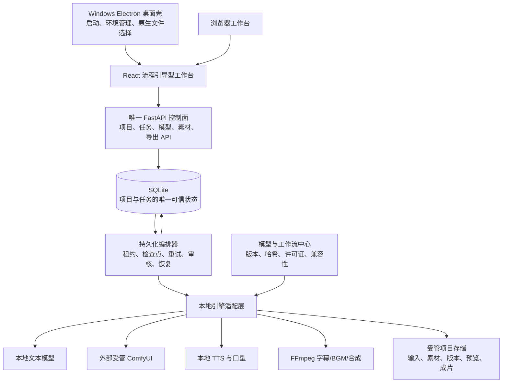

# AI Manga Studio 本地真人短剧一键生产系统设计

- 日期：2026-07-22
- 工作区：`D:\AI_Manga_Studio`
- 状态：设计已由用户逐节确认
- 目标版本：本地真人短剧生产版 1.0
- 默认硬件档位：NVIDIA RTX 5070 Ti 16GB、Windows

## 1. 摘要

本次升级把 AI Manga Studio 收敛成一个真正可一键执行、可恢复、可编辑的本地真人短剧生产系统。用户可以从一句创意、故事/剧本/小说文本、本地视频或视频链接开始，系统统一生成标准剧本、角色与场景设定、导演分镜、快速预览、高质量真人镜头、配音、口型、字幕、背景音乐、封面和最终竖屏成片。

首发目标是 30–90 秒、1080×1920 的真人短剧。系统默认全自动运行，先生成快速预览，再自动进入质量优先的正式渲染；用户也可以开启审核模式，在剧本、角色和分镜阶段暂停修改。最终导出 MP4、字幕、封面和剪映草稿。

所有 AI 推理与媒体处理在本机完成，不依赖云端推理 API。联网只用于用户主动选择的视频源获取、模型下载和软件更新；离线模型包与本地文件输入可以在断网环境中完成生产。

## 2. 已确认的产品决策

| 决策项 | 已确认选择 |
|---|---|
| 推理方式 | 完全本地，不调用云端推理 API |
| 自动化方式 | 默认全自动，可选剧本、角色、分镜审核点 |
| 内容形态 | 真人短剧优先 |
| 单集规格 | 30–90 秒，默认竖屏 1080×1920 |
| 输入类型 | 一句话创意、文本/文档、本地视频、视频链接全部支持 |
| 客户端 | Windows 桌面应用与浏览器双入口 |
| 模型部署 | 自动检测并下载、仅扫描现有模型、完整离线包三种方式全部支持 |
| 出片策略 | 先快速预览，再进行质量优先的正式渲染 |
| 导出 | MP4、字幕、封面、剪映草稿 |
| 工作台布局 | A：流程引导型；首页吸收生产监控能力，高级画布后置 |
| 架构路线 | 保留可靠任务底座，统一核心，模块化整合 |

## 3. 项目审计结论

### 3.1 AI Manga Studio

当前项目已有 Python/FastAPI、React/Vite、SQLite、本地 ComfyUI 调用、导演提示词、角色一致性、首尾帧、配音、字幕和合成等基础。V5 持久化任务底座已经实现任务创建、暂停、恢复、取消、重试、回滚预览、审核、租约和幂等命令等关键能力，是本次升级最有价值的可靠性基础。

主要问题是多个历史后端、前端、管道和启动器同时存在，包括 `backend_v3`、`backend_v4`、`backend_v6`、`backend_v7`、`backend_v10`、`backend_v11` 及多套批处理脚本。它们对“当前版本”“任务完成”和“正式生产入口”的定义不同，不能继续共同承担生产职责。

截至本次审计，V5 可靠编排 Tasks 1–6 已落在提交 `4fc448c`，此前相关编排/API 测试基线为 232 项通过。启动生命周期恢复仍是统一生产底座的首个待完成工作。现有未跟踪文件和历史资产属于用户数据，实施期间必须保留，不能批量清理。

### 3.2 参考项目能力矩阵

| 参考项目 | 可借鉴能力 | 落入 AI Manga Studio | 使用边界与风险 |
|---|---|---|---|
| LocalMiniDrama | 本地项目管理、流程/画布双视图、分镜批处理、跳过有效资产、重试、导入导出、Electron 打包 | 项目工作台、镜头编辑、桌面壳、动态端口、首次启动向导 | 作为 MIT 产品与交互参考，不引入第二套 Node 后端 |
| MoneyPrinterTurbo | TTS、字幕回退、BGM、素材时长匹配、FFmpeg 合成、任务进度、媒体参数 | 音频时间线、字幕、BGM、合成、媒体校验适配器 | 复用成熟思想与许可允许的独立模块；不把其任务系统并入主状态机 |
| AI 漫剧生成工具整合包 | 任务队列、批量操作、首尾帧、连续镜头、口型、模型管理、剪映草稿导出、项目进度 | 产品功能清单和交互需求 | 商业软件仅作只读产品参考，不复制二进制、授权文件、私有代码、提示词包或专有模型 |
| ComfyUI-aki | 便携 ComfyUI、工作流、自定义节点、模型运行环境 | 外部受管生成运行时 | 当前观察到的是压缩包而非可直接启动目录；导入前必须做完整性、许可证和兼容检查，不将整个运行时提交到源码仓库 |

## 4. 目标与非目标

### 4.1 1.0 必须实现

- 一个正式后端、一个任务数据库、一个生产执行器和一个正式启动入口。
- 从四类输入到真实成片的统一生产模型。
- 30–90 秒、1080×1920 真人短剧的快速预览和质量优先成片。
- 本地文本模型、ComfyUI、TTS、口型和 FFmpeg 的标准适配接口。
- 模型自动下载、现有目录扫描和离线包导入。
- 默认全自动和可选人工审核两种模式。
- 项目、剧本、角色、场景、分镜、素材、任务、审核和导出的持久化。
- 程序/电脑重启恢复、三次自动重试、真实取消和局部返工。
- Windows 桌面应用与浏览器工作台共享同一服务和数据。
- MP4、字幕、封面和剪映草稿导出。
- 真实失败、真实媒体验证，禁止占位内容冒充成功。

### 4.2 1.0 不包含

- 云端推理路由、云端计费和多租户账号系统。
- 多机器分布式 GPU 集群。
- 自动发布到抖音、快手、视频号等第三方平台。
- 手机端完整编辑器。
- 商用参考软件的代码、授权资源或私有模型迁移。
- 高级节点画布作为默认制作方式；它属于 1.0 之后的专业模式。

## 5. 总体架构

### 5.1 边界原则

1. SQLite 是任务和项目状态的唯一可信来源。前端不自行推断任务是否完成。
2. 编排器只依赖适配器契约，不直接拼接历史脚本或某个特定工作流。
3. ComfyUI 是可发现、可启动、可健康检查的外部运行时，不复制进源码仓库。
4. 大型媒体文件保存在项目目录，数据库保存相对路径、大小、校验值、版本和媒体信息。
5. 桌面端和浏览器端使用同一 React 应用、API 和数据库，不产生两套行为。
6. 旧版本在迁移完成前保留为只读参考，不再作为正式入口；删除或归档必须另行确认。

### 5.2 核心模块

| 模块 | 职责 | 依赖 |
|---|---|---|
| Desktop Supervisor | 单实例、端口、服务生命周期、首次安装、日志入口、安全退出 | FastAPI、ComfyUI、React 构建产物 |
| Project Service | 项目、输入、剧本、角色、场景、分镜和版本 | SQLite、项目存储 |
| Durable Orchestrator | 排队、租约、心跳、检查点、审核、重试、回滚、取消、恢复 | SQLite、执行适配器 |
| Input Adapters | 创意、文档、视频文件、链接的采集与标准化 | 本地解析器、媒体探测、可选网络获取器 |
| Model Registry | 扫描、下载、离线导入、校验、许可证、兼容性 | 文件系统、模型清单、ComfyUI 节点清单 |
| Generation Adapters | 文本、图像/视频、TTS、口型的统一运行接口 | 本地模型运行时、ComfyUI |
| Media Pipeline | 字幕、BGM、封面、音频混合、视频合成、剪映草稿 | FFmpeg、模板与字体资源 |
| Validators | JSON、图片、视频、音频、连续性和最终成片校验 | 媒体探测、项目计划 |

## 6. 统一项目与数据模型

### 6.1 核心实体

在现有 `jobs`、`job_steps`、`artifacts`、`job_events` 和审核记录基础上，引入或规范以下领域实体：

- `projects`：项目名称、输入类型、目标时长、画幅、质量预设、自动/审核模式。
- `source_items`：创意文本、文档、视频、URL、来源信息和版权确认。
- `scripts`：标准剧本版本、节拍、对白、旁白和情绪曲线。
- `characters`：身份锚点、外观、服装、声音、参考图和版本。
- `scenes`：地点、时间、灯光、环境、连续性和参考图。
- `shots`：镜头顺序、时长、景别、机位、动作、对白、角色/场景引用、首尾帧、生成设置。
- `artifacts`：每个输入版本和步骤产生的脚本、图像、视频、音频、字幕、封面、预览与成片。
- `model_installations`：模型位置、版本、哈希、许可证、显存档位和可用状态。
- `workflow_installations`：工作流版本、节点依赖、模型依赖和验证状态。
- `exports`：导出格式、模板、范围、状态、输出和校验信息。

### 6.2 版本与失效

每个可执行步骤计算 `input_hash`，包含上游产物校验值、配置快照、提示词/脚本版本、模型与工作流版本、随机种子和目标媒体参数。恢复时同时校验 `input_hash` 与输出文件；两者均有效才允许跳过。

编辑剧本、角色、场景或某个镜头会创建新版本，并通过显式依赖图使受影响的下游检查点失效。旧文件不会立即删除，可用于对比、撤销和审计。单镜头修改不得让无关镜头重跑。

## 7. 一键生产流水线

### 7.1 输入标准化

1. **一句创意**：本地文本模型生成故事核心、人物关系、冲突、节拍和完整短剧剧本。
2. **故事/剧本/小说**：识别结构和对白，压缩改编为 30–90 秒的竖屏短剧。
3. **本地视频**：提取媒体信息、音频、字幕、镜头边界和剧情摘要，生成二创制作计划。
4. **视频链接**：先记录来源和使用权确认，再用可插拔获取器保存为受管本地输入，之后与本地视频相同处理。获取失败必须明确报错，不绕过平台访问限制。

四类输入最终生成相同的标准剧本、角色、场景和镜头模型。链接输入可能需要网络，但后续 AI 推理仍完全本地。

### 7.2 剧本与制作圣经

- 生成标准剧本、情绪曲线、角色关系和镜头节拍。
- 为主要角色建立稳定身份锚点：面部、年龄、体态、服装、声音和禁止漂移项。
- 为场景建立地点、时间、灯光、空间关系和连续性约束。
- 审核模式在剧本和角色设定完成后暂停；自动模式直接继续。

### 7.3 导演分镜

- 默认将成片拆为约 3–6 秒的镜头，允许按动作和对白调整。
- 每个镜头明确景别、机位、运镜、动作、情绪、对白、角色、场景和首尾帧策略。
- 分镜计划检查总时长、对白容量、人物连续性和空间关系。
- 连续镜头可将前一镜头有效尾帧作为后一镜头首帧；用户指定首帧时优先使用用户资产。

### 7.4 快速预览

- 使用较低成本的模型参数和分辨率生成分镜图、临时运动、临时配音和粗剪。
- 预览是独立产物，不得覆盖正式素材。
- 自动模式在预览校验通过后继续正式渲染。
- 审核模式允许修改剧本、角色或镜头，并只回滚受影响的步骤。

### 7.5 高质量真人渲染

- 先生成或确认角色与场景参考，再生成镜头首帧、尾帧和视频。
- 质量预设以人物一致性、镜头稳定性和可用率优先，而不是最短出片时间。
- RTX 5070 Ti 16GB 默认一次只运行一个大型视频或口型工作流；各阶段完成后释放模型和显存。
- 失败镜头自动重试，校验通过的镜头直接复用。
- 显存不足时，允许执行预先批准的恢复顺序：清理缓存、卸载无关模型、降低并发、重新排队；不得静默降低最终目标分辨率或替换为占位内容。

### 7.6 声音与后期

- 本地多角色 TTS 根据角色声线映射生成对白和旁白。
- 有对白的真人镜头按项目设置执行本地口型工作流。
- 字幕优先使用 TTS 时间戳；缺失时可由本地语音识别生成并校正。
- 音频时间线包含对白、环境声和 BGM，并执行响度、削峰和时长对齐。
- FFmpeg 合成镜头、转场、字幕和混音，生成封面与竖屏安全区布局。

### 7.7 质检与导出

最终检查至少包括：文件存在与校验值、可解码、分辨率、帧率、时长、关键帧、黑帧、静音、字幕越界、镜头缺失、音画总时长和角色连续性。只有真实 MP4 通过验证后任务才能进入 `completed`。

导出内容为：

- 1080×1920 MP4 成片；
- SRT/ASS 字幕；
- 竖屏封面；
- 剪映草稿，包含镜头、音频、字幕、BGM、基础转场和素材引用。

## 8. 模型与工作流中心

### 8.1 三种安装方式

1. **自动检测并按需下载**：扫描现有资源，只下载缺失项，支持断点续传和哈希校验。
2. **仅扫描现有模型**：用户选择 D/Z 盘或其他目录，系统建立外部引用，不移动大型文件。
3. **完整离线包**：导入带清单、版本、许可证和哈希的离线包，在断网机器上安装。

三种方式写入同一注册表，生产任务不关心模型来自哪种安装方式。

### 8.2 启动前预检

- ComfyUI 地址、版本和队列可用性；
- 工作流 JSON 可解析，所需自定义节点存在；
- 模型文件存在且哈希匹配；
- 模型许可证信息可查看并被接受；
- 当前 GPU/显存满足预设或有明确的卸载方案；
- FFmpeg/ffprobe 可执行并报告支持的编码器；
- 磁盘空间满足预览、正式渲染和临时文件的估算。

`Z:\ComfyUI-aki` 当前是压缩包，不能被当作已安装运行时。模型中心只在完整性验证通过、用户确认安装位置和许可证后解压；失败时保留原包并给出可读错误。

## 9. 桌面启动器与工作台

### 9.1 一键启动

- Electron 桌面壳获取单实例锁，避免重复启动多个后端和 Worker。
- 自动选择可用本地端口，并将实际地址传给前端，不硬编码 `localhost` 端口。
- 启动顺序为数据库备份/迁移、FastAPI、Worker、ComfyUI 发现或启动、健康检查、打开窗口。
- 首次启动进入安装向导；后续启动打开最近项目和当前任务。
- 启动失败显示用户可读原因、自动修复操作和日志位置。
- 关闭时询问“继续后台运行”或“安全停止”；安全停止不领取新步骤，保存状态后结束外部任务。

浏览器入口访问同一个 FastAPI 服务。桌面壳提供原生文件选择、运行时管理和通知，但不拥有独立业务状态。

### 9.2 信息架构

- 首页吸收生产监控布局：最近项目、运行任务、系统健康、显存和磁盘状态。
- 项目主界面采用已确认的流程引导布局：输入 → 剧本 → 角色/场景 → 分镜 → 预览 → 高清成片 → 导出。
- 中央显示当前阶段、预览播放器和镜头时间线。
- 右侧显示进度、预计剩余时间、当前模型、错误/审核卡片和“继续自动制作”主操作。
- 点击镜头打开高级抽屉，编辑提示词、角色引用、首尾帧、配音、口型和局部重跑范围。
- 模型中心、任务记录和设置作为一级功能。
- 节点画布只作为后续高级导演模式，不影响首发的一键主线。

### 9.3 新建项目

创建项目只要求选择或输入内容，并确认默认质量预设。目标时长、竖屏分辨率、预览后自动继续和声音能力默认已配置。模型、采样、工作流和显存参数放入高级设置，避免非技术用户在开始前面对大量参数。

## 10. 错误恢复与数据安全

### 10.1 状态与重试

任务和步骤采用明确状态：`draft`、`queued`、`running`、`waiting_review`、`retry_wait`、`paused`、`failed`、`completed`、`cancelled`。启动、暂停、恢复、取消、重试、审核和回滚操作使用幂等键，重复点击不会重复创建或重复执行命令。

每个步骤首次失败后最多自动重试三次，建议退避为 5、15、45 秒。错误分类至少覆盖输入无效、配置缺失、模型/节点缺失、服务不可达、显存不足、磁盘不足、工作流拒绝、超时、产物校验失败、合成失败和用户取消。

### 10.2 崩溃与重启恢复

- Worker 使用租约和心跳声明任务所有权。
- 进程或电脑重启后，过期 `running` 任务回到恢复队列。
- 已验证检查点保持有效，`failed`、`paused` 和 `waiting_review` 保持原状态。
- 取消请求同时写数据库并通知外部执行器；外部工作真正停止后才标记 `cancelled`。
- 产物先写临时位置，验证后原子提交，再推进数据库状态。

### 10.3 真实失败原则

ComfyUI 未启动、模型缺失、节点不兼容、输出损坏或 FFmpeg 失败都必须呈现真实故障。禁止生成空白图片、标题卡、插值视频、第一镜头复制品或空文件来冒充成功。模拟测试和真实模型测试在测试报告中明确区分。

### 10.4 数据与来源保护

- 原始输入不覆盖，项目按版本、镜头和生成轮次保存。
- SQLite 使用事务、迁移和自动备份。
- 项目导入导出必须保留来源、模型/工作流版本和校验值。
- 视频链接输入保存来源和用户使用权确认，不绕过访问控制。
- 参考项目默认只读；不得写入、移动或删除其中的文件。
- 清理旧素材是独立、可预览、需确认的操作，不作为恢复流程副作用。

## 11. 接口方向

现有 V5 任务 API 保持兼容并扩展领域接口。建议的接口组如下：

| 接口组 | 主要职责 |
|---|---|
| `/api/projects` | 创建、查询、设置、归档和导入项目 |
| `/api/projects/{id}/sources` | 上传文本/文档/视频、登记链接、标准化输入 |
| `/api/projects/{id}/scripts` | 剧本版本、审核和改写 |
| `/api/projects/{id}/characters` | 角色身份、参考图和声线 |
| `/api/projects/{id}/scenes` | 场景与连续性资产 |
| `/api/projects/{id}/shots` | 分镜、镜头编辑、首尾帧和局部失效预览 |
| `/api/jobs` | 创建、查询和分页任务 |
| `/api/jobs/{id}` | 任务快照、步骤、产物和错误 |
| `/api/jobs/{id}/events` | SSE 实时事件；不可用时前端短轮询兜底 |
| `/api/jobs/{id}/pause|resume|retry|rollback|cancel` | 幂等任务控制 |
| `/api/steps/{id}/review` | 批准、修改、重做和继续 |
| `/api/runtime` | 硬件、ComfyUI、FFmpeg 和健康检查 |
| `/api/models` | 扫描、下载、离线导入、校验和兼容性 |
| `/api/exports` | MP4、字幕、封面和剪映草稿任务 |

领域接口只创建或修改持久化命令；耗时工作全部由 Worker 领取，API 请求不直接执行长时间模型任务。

## 12. 测试与验收

### 12.1 自动化测试层级

1. **单元测试**：状态转换、依赖失效、哈希、配置、媒体校验、错误分类。
2. **数据库测试**：迁移、事务、幂等命令、租约、重启恢复、并发领取和备份恢复。
3. **适配器契约测试**：文本、ComfyUI、TTS、口型、FFmpeg 的统一输入输出和取消语义。
4. **模拟引擎集成测试**：快速、确定地覆盖完整生产链和所有故障分支。
5. **真实运行时冒烟测试**：使用实际 ComfyUI、FFmpeg 和代表性模型验证最小镜头。
6. **界面端到端测试**：桌面/浏览器启动、创建项目、进度恢复、审核、局部重跑、错误处理和导出。
7. **媒体验收**：ffprobe 与解码测试、时长、分辨率、音轨、字幕、安全区、黑帧和静音。

### 12.2 必测故障

- 启动时存在未完成任务；
- 后端、Worker 或电脑在步骤执行中重启；
- ComfyUI 失联或输出超时；
- 模型、节点、工作流或 FFmpeg 缺失；
- 显存不足、磁盘不足、输出损坏；
- 用户重复点击启动、暂停、重试、回滚和取消；
- 预览完成后修改单个镜头；
- 外部任务取消失败或租约丢失；
- 剪映草稿引用的素材缺失；
- 模拟产物被错误标记为真实成片。

### 12.3 1.0 交付门槛

在 RTX 5070 Ti 16GB 的目标机器上，以至少一个 30–90 秒真人竖屏样例完成：

- 从受支持输入到快速预览；
- 从预览到真实 1080×1920 成片；
- 多角色配音、字幕、BGM 和至少一个口型镜头；
- MP4、字幕、封面和剪映草稿导出；
- 中断后从检查点恢复；
- 单镜头修改只重跑相关下游；
- 最终媒体检查通过；
- 后端测试、前端构建/测试、桌面打包测试全部通过。

真实模型未执行的场景只能报告为模拟通过，不能计入实机交付门槛。

## 13. 五个实施子项目

本设计是总体产品设计，不应被执行成一次超大改动。实施拆成五个可独立验收的子项目，全部完成后形成 1.0。

### 子项目 1：统一生产底座

- 完成 FastAPI 生命周期启动恢复。
- 确立唯一后端、配置、数据库、Worker、执行器和正式入口。
- 建立领域实体与迁移边界。
- 为历史入口建立清晰的兼容/归档标记，不删除用户文件。
- 验收：可靠任务测试通过，重启能恢复，正式入口不调用历史占位链。

### 子项目 2：本地运行与模型中心

- ComfyUI、FFmpeg、显卡和模型发现。
- 自动下载、目录扫描、离线包导入。
- 版本、哈希、许可证、节点和显存兼容检查。
- 文本、视频、TTS、口型和合成适配器契约。
- 验收：缺失/损坏/不兼容资源均在执行前被明确阻止。

### 子项目 3：完整生产流水线

- 四类输入标准化。
- 剧本、角色、场景、分镜、预览和高清真人渲染。
- 配音、口型、字幕、BGM、封面、合成、质检和剪映导出。
- 审核点与局部重跑。
- 验收：模拟全链稳定通过，并完成真实运行时代表性样例。

### 子项目 4：桌面与浏览器工作台

- 流程引导型项目界面、生产监控首页和高级镜头抽屉。
- 任务队列、模型中心、错误修复和设置。
- Electron 桌面打包、首次安装向导和安全退出。
- 验收：非技术用户可从桌面图标完成创建、生产、恢复和导出。

### 子项目 5：硬件验收与发布

- 5070 Ti 16GB 性能与显存策略验证。
- 故障注入、端到端媒体验收、升级与项目迁移。
- 安装包、版本说明、用户指南和恢复指南。
- 验收：满足第 12.3 节全部门槛后才能标记 1.0 完成。

## 14. 风险与缓解

| 风险 | 缓解措施 |
|---|---|
| 16GB 显存难以同时容纳大型真人视频和口型模型 | 阶段装载、单大型任务并发、显存回收、兼容档位预检 |
| 真人角色跨镜头漂移 | 身份锚点、角色参考、首尾帧、连续性检查、失败镜头局部重试 |
| ComfyUI 自定义节点/工作流版本漂移 | 注册表锁定版本，执行前检查节点与模型清单，保存工作流快照 |
| 历史入口和用户资产混杂 | 新入口显式收敛，旧目录只读保留，迁移按选择执行 |
| 链接下载受平台规则和网络影响 | 可插拔获取器、来源确认、真实失败、本地文件作为稳定入口 |
| 剪映草稿格式变化 | 独立导出适配器、模板版本和可验证素材引用 |
| 大量模型下载失败或磁盘不足 | 清单、容量预估、断点下载、哈希校验、外部目录引用 |
| 商用参考资源的许可证不清晰 | 只借鉴功能概念，不复制二进制、代码、私有模型或授权文件 |

## 15. 完成定义

只有同时满足以下条件，才能向用户宣称“一键本地真人短剧系统升级完成”：

- 正式入口、任务数据库和生产执行器均唯一且文档明确；
- 四类输入均能进入统一项目模型；
- 默认全自动流程能生成预览并继续到真实高清成片；
- 审核模式能在指定阶段修改并局部返工；
- 程序和电脑重启后任务可恢复；
- ComfyUI、模型、TTS、口型和 FFmpeg 失败不会伪装成成功；
- 目标硬件上真实 30–90 秒样例通过媒体验收；
- MP4、字幕、封面和剪映草稿可用；
- 自动化测试、真实运行时冒烟、界面端到端和桌面打包证据齐全；
- 参考项目和用户历史资产未被覆盖、删除或未经确认迁移。

下一步只为“子项目 1：统一生产底座”编写详细实施计划。后续子项目在前一个子项目验收后分别制定计划，避免一次性改动越过可验证边界。
